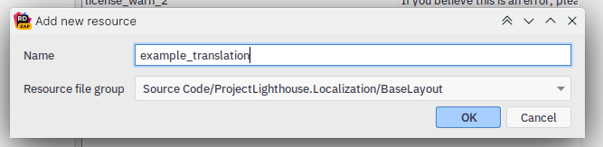
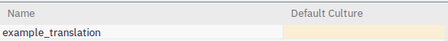

# Localization

Translations in Lighthouse are done with [Crowdin](https://crowdin.com/project/project-lighthouse).

For development, it is not important to worry about Crowdin; once your translations are merged into `main`,
the appropriate translation changes will be uploaded to Crowdin for community members to translate.

## Creating translations

### `Strings.cs` files

Start by heading to `ProjectLighthouse.Localization` and open the `StringLists` directory.
You can either create a new file with the format `<TranslationArea>Strings.cs` or pick one that exists.

A `TranslationArea` is an enum that can be found at the root of the Localization project.
It's purpose serves to split up unrelated translations and provide organization.

Let's take a look at a simple `Strings.cs` file.

```csharp
public static class AreaStrings
{
    public static readonly TranslatableString Translation = create("key");
    public static readonly TranslatableString OtherTranslation = create("other_translation");

    private static TranslatableString create(string key) => new(TranslationAreas.Area, key);
}
```

As you can see, it's not complicated to figure out at all, but I should go over it anyway.

At the top, we have two `public static readonly TranslatableString`s. These are what we will use to actually translate.

The names can be anything you want, but you must create them through the `create(key)` function.
The key is the name of the key in the `.resx` file, which we will go over in the next section.

At the bottom you'll notice a helper function.
This is to reduce duplicate code, make the class prettier, and most importantly save a bit of time when creating new
translations.
It creates a new `TranslatableString` with a `TranslationArea` set to `Area` with our key.

### `.resx` files

`.resx` files are called XML resource files. In Lighthouse, we use them to store translations.

They can be interacted with programatically fairly easily, and are compiled down to a different format to save space in the final build.

The best part is Crowdin can recognize and parse these files, and create its own `.resx` files.

This is the basis of how translations are done. 
Lighthouse will look up translations in these files using the key and `TranslationArea` given in a `TranslatableString`.

To add a translation here, lets move to the root of the `Localization` project.

You've probably already noticed the absurd amount of `.resx` files for each area and then each supported language.
This is normal; and there's not much we can do about it, unfortunately.

For development, you do not need to worry about the .resx files for each language; just the ones with no language specified.
These files are the 'source' for translations.

For this doc, I'm going to use JetBrains Rider's Localization Manager as a reference.
I imagine Visual Studio has something similar, but worst case scenario you can edit the `.resx` files manually.

This is the `BaseLayout.resx` file shown in this window:


The 'Name' column represents the key, and the 'Default Culture' column represents the text in English.

Using the plus symbol, you can create a new translation. Let's create a new one called `example_translation`. 
Clicking the plus symbol, this window appears:



Type your key in the top box, and Rider will select the current `.resx` file automatically.

This is how the new key will look:



You can now enter the text you want in the right column labelled 'Default Culture'.

Once this is created, save your changes and this key will now be available to use in a `Strings.cs` file, like so:

```csharp
public static readonly TranslatableString ExampleTranslation = create("example_translation");
```

## Using translations

Now that we've created a translation, it's time to use it in Lighthouse. 

There are a couple ways of doing this. I will go over the two most important ones here.

### Method 1: Using it in a Razor (`.cshtml`) page

This is the easiest method, and most common. Make sure you've imported the translation lists at the top of the file:

```cshtml
@using LBPUnion.ProjectLighthouse.Localization.StringLists
```

Now, as long as your page extends `BaseLayout`, you can translate them like so:

```csharp
@Model.Translate(BaseLayoutStrings.ExampleTranslation)
```

This method will automatically determine the language of the user and provide a translation for it.

If your string is formatted (oh, strings can be formatted by the way with the typical `{0} {1}, etc.` method)
you can provide the parameters as you would expect to be able to:

```csharp
@Model.Translate(BaseLayoutStrings.ExampleTranslationFormatted, foo, bar, 123)
```

### Method 2: `TranslatableString.Translate()`

todo